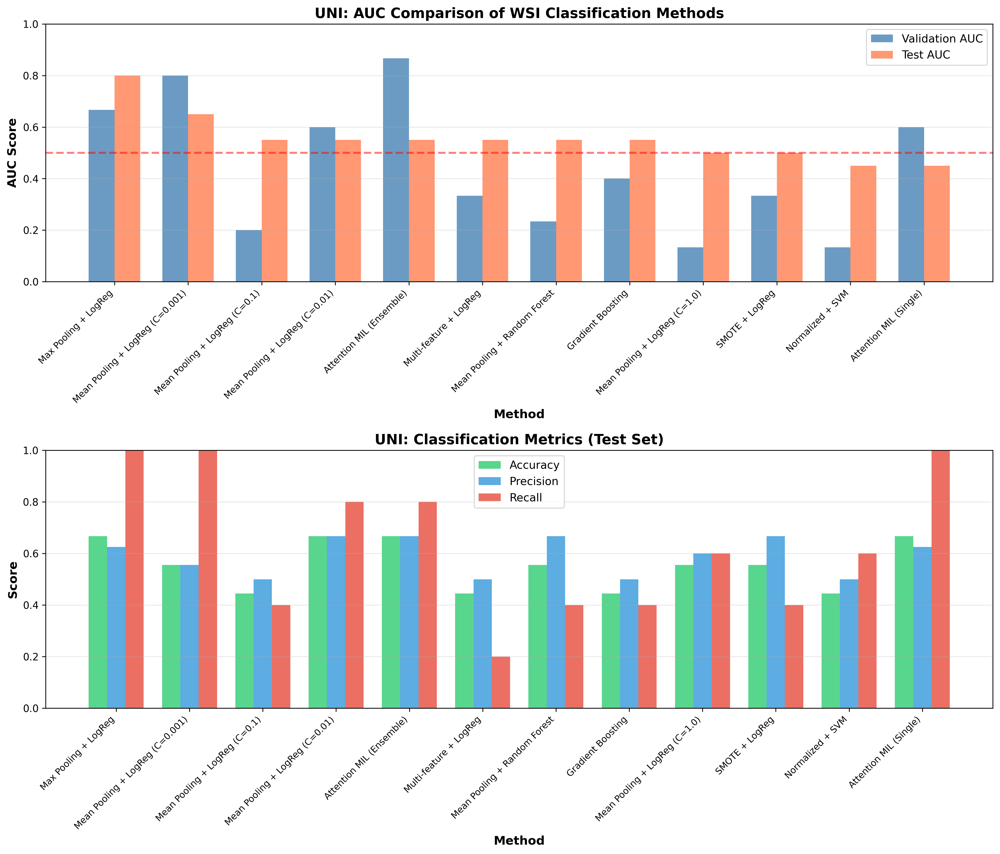
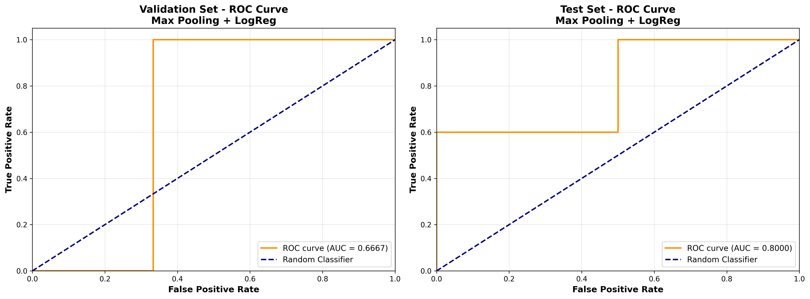
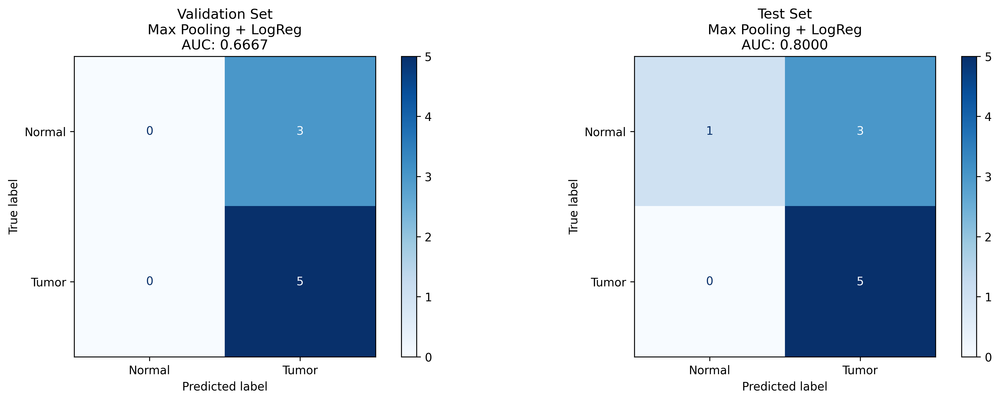
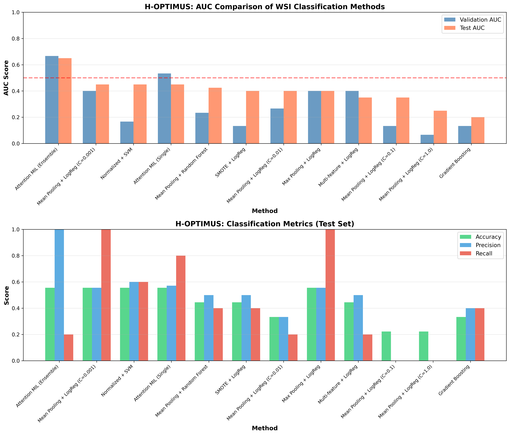
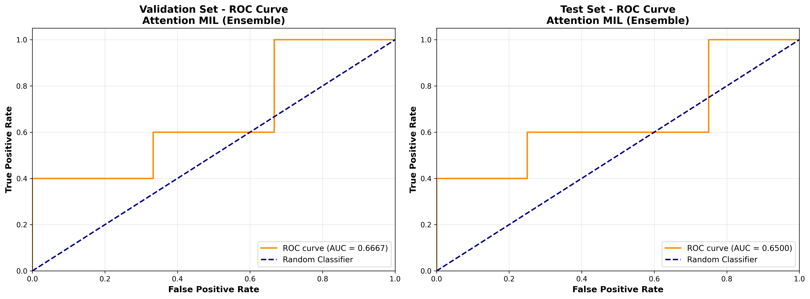
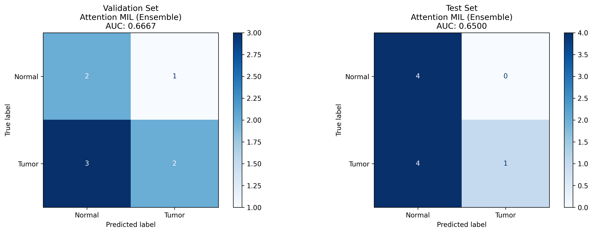
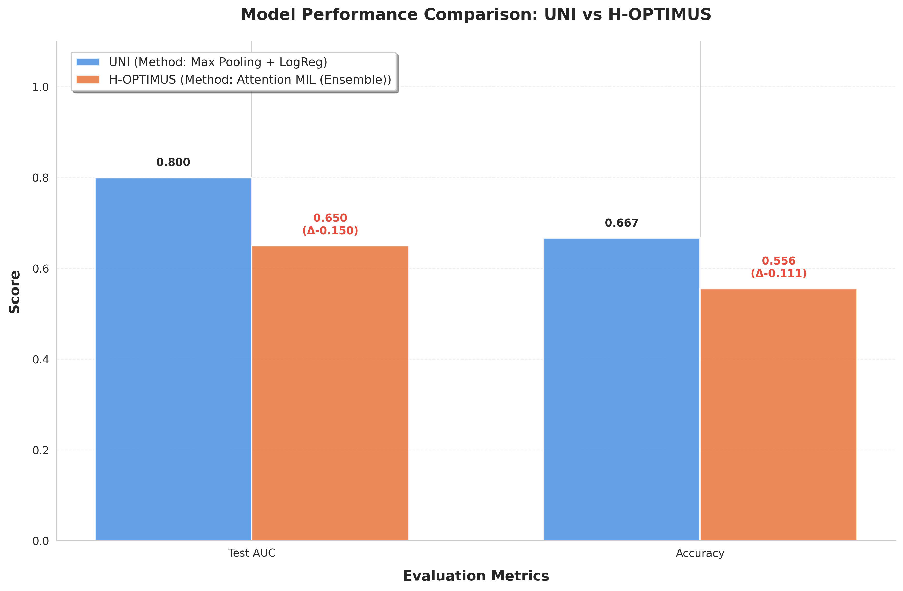

# Learning Biomarkers in Oncology: UNI vs H-OPTIMUS Comparison


## Project Overview

This project compares two state-of-the-art foundation models for computational pathology in oncology: **UNI** (Universal Pathology) and **H-OPTIMUS** (Bioptimus).Evaluated their performance on Whole Slide Image (WSI) classification using 9 different aggregation methods.

### Key Objectives
- Extract patch-level embeddings from histological WSIs
- Compare UNI vs H-OPTIMUS foundation models
- Evaluate 9 aggregation strategies for WSI-level classification
- Identify optimal model-method combinations

---

## Dataset

### CAMELYON16 Preprocessed Dataset

This project uses a preprocessed version of the CAMELYON16 dataset, created and maintained by [Wassim Chikhi](https://www.kaggle.com/wassmed).

**Dataset Link**: [CAMELYON Preprocessed v4 Patches](https://www.kaggle.com/datasets/wassmed/camelyon-prepro-v4-patches/data)

### Dataset Structure
```
camelyon-prepro-v4-patches/
├── patches/                         # All extracted tissue patches (256×256)
├── patches_metadata.csv             # Patch-level metadata (no split)
└── patches_metadata_with_split.csv  # Patch-level metadata with WSI-level split
```

### Dataset Specifications

- **Source**: CAMELYON16 Whole Slide Images (WSI)
- **Patch Size**: 256 × 256 pixels
- **Max Patches per WSI**: 300 (balanced representation)
- **Total WSIs**: 54 (39 train, 8 validation, 9 test)

### Quality Filtering Pipeline

All patches underwent strict quality control:
- Background/white region removal
- Low-saturation filtering
- Low-variance (uniform) patch removal
- Blur detection (Laplacian variance threshold)

### Train/Validation/Test Split

⚠️ **CRITICAL**: The split is performed at **WSI-level**, not patch-level.

| Split | WSIs | Normal | Tumor |
|-------|------|--------|-------|
| Train | 39   | 17     | 22 |
| Val   | 8    | 3      | 5  |
| Test  | 9    | 4      | 5  |

**Split Strategy**:
- All patches from the same WSI belong to the same split
- Stratified by WSI label (normal/tumor)
- Prevents data leakage and ensures fair evaluation
- Column: `split ∈ {train, val, test}` in `patches_metadata_with_split.csv`

### Class Distribution

- **Tumor**: ~57%
- **Normal**: ~43%

This imbalance reflects the original CAMELYON16 distribution and is intentional. Class balancing (if needed) should be handled during training (e.g., loss weighting).

### Loading the Dataset
```python
import pandas as pd

# Load metadata with split information
DATA_ROOT = "/path/to/camelyon-prepro-v4-patches"
df = pd.read_csv(f"{DATA_ROOT}/patches_metadata_with_split.csv")
PATCH_DIR = f"{DATA_ROOT}/patches"

# Select training patches
train_df = df[df["split"] == "train"]

# Select validation patches
val_df = df[df["split"] == "val"]

# Select test patches
test_df = df[df["split"] == "test"]
```

### Reproducibility Guidelines

 **DO**:
- Use `patches_metadata_with_split.csv` exclusively
- Respect the pre-defined WSI-level split
- Report results at WSI-level
- Evaluate strictly on validation/test splits

 **DON'T**:
- Create a new split
- Mix patches from different splits
- Force 50/50 class balance at WSI-level
- Use patches from test set during training/validation

### Project Context

This dataset serves as a common experimental ground for two complementary methods:

- **Method 1** (Wassim Chikhi): STR-based Random Walk with spatio-temporal representation
- **Method 2** (Hadia AMJAD): UNI vs H-OPTIMUS foundation models benchmark

Both methods use identical data, splits, and evaluation protocols to ensure scientifically valid comparisons.


## Methodology: Method 2

### Foundation Models
1. **UNI** - Mahmood Lab's Universal Pathology Foundation Model
   - Pre-trained on 100M+ histopathology images
   - 768-dimensional embeddings

2. **H-OPTIMUS** - Bioptimus Foundation Model
   - Recent architecture optimized for pathology
   - 768-dimensional embeddings

### 9 Aggregation Methods Tested

| Method | Description |
|--------|-------------|
| 1. Mean Pooling + LogReg | Average pooling with logistic regression |
| 2. Max Pooling + LogReg | Maximum pooling with logistic regression |
| 3. Multi-Feature Aggregation | Combines mean, max, and std features |
| 4. Random Forest | Ensemble tree-based classifier |
| 5. SVM with Normalization | Support Vector Machine with feature scaling |
| 6. SMOTE + LogReg | Synthetic oversampling for class balance |
| 7. Gradient Boosting | Boosted decision trees |
| 8. Simple Attention MIL | Single attention-based MIL model |
| 9. Attention MIL Ensemble | Ensemble of attention MIL models |

---

## Key Results

### UNI Performance
- **Best Method**: Max Pooling + Logistic Regression
- **Test AUC**: 0.80
- **Test Accuracy**: 0.67
- **Key Finding**: Simple pooling outperforms complex methods

### H-OPTIMUS Performance
- **Best Method**: Attention MIL Ensemble
- **Test AUC**: 0.65
- **Test Accuracy**: 0.56
- **Key Finding**: Requires sophisticated aggregation

### Comparison Summary

| Model | Best Method | Test AUC | Accuracy | Winner |
|-------|-------------|----------|----------|--------|
| **UNI** | Max Pooling + LogReg | **0.80** | **0.67** | ✅ |
| H-OPTIMUS | Attention MIL (Ensemble) | 0.65 | 0.56 | |
| **Difference** | - | **+15%** | **+11%** | |

** Overall Winner: UNI**

---

## Visualizations

### UNI Results
[](UNI2-h/uni_complete_comparison.png)
*Complete comparison of all 9 methods using UNI embeddings*

[](UNI2-h/best_method_roc_curves.png)
*ROC curves for the best-performing UNI method*

[](UNI2-h/best_method_confusion_matrices.png)
*Confusion matrix for the best UNI method*

### H-OPTIMUS Results

[](H_Optimus/hoptimus_complete_comparison.png)
*Complete comparison of all 9 methods using H-OPTIMUS embeddings*

[](H_Optimus/best_method_roc_curves_hoptimus.png)
*ROC curves for the best-performing H-OPTIMUS method*

[](H_Optimus/best_method_confusion_matrices_hoptimus.png)
*Confusion matrix for the best H-OPTIMUS method*

### Direct UNI vs H-OPTIMUS Comparison

[](Comparison/uni_vs_hoptimus_comparison.png)
*Head-to-head comparison of the best UNI and H-OPTIMUS methods*

---

## Getting Started

### Prerequisites
```bash
Python 3.8+
PyTorch 1.12+
scikit-learn
pandas
matplotlib
seaborn
```

### Installation
```bash
# Clone the repository
git clone https://github.com/HadiaAmjad4/Learning-Biomarkers-in-Oncology-from-Histopathology-Whole-Slide-Images-WSI


# Install dependencies
pip install -r requirements.txt
```

---

## Repository Structure

```
Learning_Biomarkers_Notebooks/
├── data/                   # Data directory (not in git)
├── UNI2-h/                    # Source code
│   ├── csv_files
│   ├── Uni_emd_pt
│   ├── 01-uni-embedding-extraction.ipynb         #UNI embedding Extraction
│   └── 02-uni-wsi-aggregation.ipynb              #Aggregation Methods
|   └── best_method_confusion_matrices.png
├   └── best_method_roc_curves.png
├── └── uni_complete_comparison.png
├── H_Optimus/                    
│   ├── csv_files
│   ├── emb_pt_H_OP
│   ├── 00-dataset-sanity-check.ipynb            #Dataset Sanity Check
│   └── 01-hoptimus-embedding-extraction.ipynb   #H-Optimus embedding Extraction
|   └── 02-h-opt-wsi-aggregation-ipynb.ipynb     #Aggregation Methods
├   └── best_method_confusion_matrices_hoptimus.png
├   └── best_method_roc_curves_hoptimus.png
|   └── hoptimus_complete_comparison.png
├── Comparison/                    
│   ├── comparison-uni-h-opt.ipynb              #Side by Side comaparison of both models based on AUC(test) and Accuracy
│   ├── uni_vs_hoptimus_comparison.png
└── README.md
```

---

##  Key Findings

### 1. Model Quality Matters Most
UNI's superior pre-training translates to +15% AUC improvement over H-OPTIMUS, regardless of aggregation method.

### 2. Method-Model Interaction
- **UNI**: Works best with simple pooling (Max Pooling)
- **H-OPTIMUS**: Requires sophisticated aggregation (Attention MIL)

### 3. Simplicity Can Win
The simplest method (Max Pooling) outperformed complex ensemble approaches for UNI embeddings.

### 4. Overfitting Concerns
Attention MIL showed high validation AUC (0.87) but poor test AUC (0.55) with UNI, indicating overfitting on small datasets.

---

## Future Work

- [ ] Evaluate on larger datasets (current test: 9 WSIs)
- [ ] Explore ensemble combining UNI + H-OPTIMUS
- [ ] Test Graph Neural Networks for patch aggregation
- [ ] Add interpretability analysis (attention visualization)
- [ ] Implement cross-validation for more robust estimates
- [ ] Test on multi-class cancer classification

---

## References

1. **UNI Model**: [Nature Medicine, 2024](https://www.nature.com/articles/s41591-024-02857-3)
2. **H-OPTIMUS**: [Bioptimus Releases](https://github.com/bioptimus/releases/tree/main/models/h-optimus/v0)
3. **Foundation Models Comparison**: [Nature Communications, 2025](https://www.nature.com/articles/s41467-025-58796-1)

---

##  Author

**Hadia AMJAD**  
M2 (VMI)  
Université Paris Cité  
January 2026


## Acknowledgments

- Mahmood Lab for the UNI model
- Bioptimus for the H-OPTIMUS model
- CAMELYON16 dataset contributors
- Université Paris Cité - M2 VMI program

---

## Contact

For questions or collaborations, please open an issue or contact [hadiaamjad4812@gmail.com]
